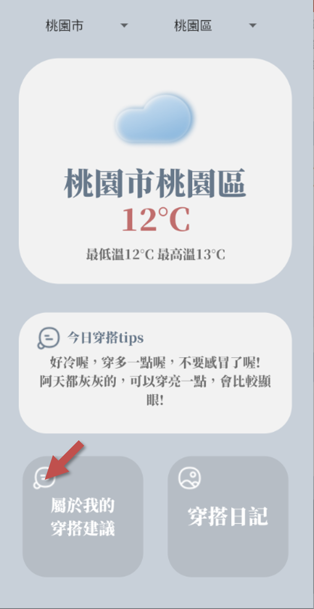
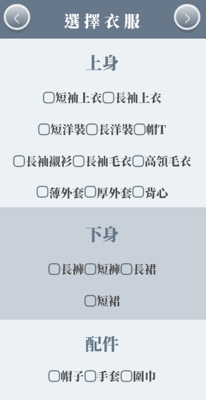

# WeatherApp
此軟體針對使用者原本預想的穿著和天氣溫度做結合，給予使用者能 夠修正自己穿搭的建議，避免出門後發現今日穿著和天氣不符合的狀況。

# 系統簡介 
a. 應用程式名稱：超神天氣穿搭
b. 動機 
    待在室內的我們常常不知道戶外實際的溫度，如果起床後或睡前沒有
先觀看氣象預報，只是看當下天氣情況，或是穿自己想穿的衣服就直接出
門，容易發生不夠保暖或太過悶熱等令人渾身不舒服的狀況，因此想要開
發一款使用獨特計算穿衣溫度的方法結合天氣狀況，給予使用者在出門前
穿衣建議的軟體。
c. 目的 
    此軟體針對使用者原本預想的穿著和天氣溫度做結合，給予使用者能
夠修正自己穿搭的建議，避免出門後發現今日穿著和天氣不符合的狀況。
d. 系統特色 
* 穿衣建議 
 
  依據使用者原本的穿著和當天的溫度，例如：在 13 度穿著短褲、短袖時，我們會建議他穿長袖長褲。其中我們參考了 popdaily 中的穿搭建議，像是人的體溫在 26 度時會達到最舒服的狀況，根據此點，     我們選擇看當天的氣溫加上不同衣服會給予人不同的溫度去做加減，盡可能給出建議，讓使用者可以透過穿著達到最剛好的溫度。
* 穿搭日記 
 
  讓使用者在體驗完穿搭建議後，也能紀錄當日穿著，藉由從相簿挑選今日衣著的照片讓使用者日後能翻閱過往的穿搭歷程，同時提供增加和刪除按鈕，讓使用者能自由地修改日記。
* 氣象預報/描述 
 
  藉由爬取政府提供的 API，我們能夠得知更加即時的天氣狀況資料，其中我們可以從當下天氣和最低最高溫度得知該如何給予使用者穿搭層面的建議。
  
### App 下載

# 使用教學

### 穿衣建議

  1.首頁點選 _穿搭建議_ 鈕
  
  
  
  2.選擇當日穿著
  
  
  
  3.結果顯示
  
  
  
### 穿搭日記
  
  - 新增日記
  
    1.點擊新增鈕
    
    
   
    2.點選欲新增之圖片
   
    
    
    3.點選**右上角**可回到日記瀏覽頁面
    
    
    
    4.日記瀏覽頁面
    
    
    
  - 刪除日記
    
    1.點選欲刪除之日記
    
    
    
    2.點擊**左下角**刪除鈕
    
      
    
    3.如確定要刪除，則點擊確認
    
    
    
    4.顯示已刪除之畫面
  
    
  
  - 編輯日記
    
    1.至欲編輯之日記頁面中，點擊**右下角**編輯鈕
    
    
    
    2.進入圖庫挑選新照片
    
    
    
    3.點擊**右上角**儲存鈕
    
    
    
    4.回到日記頁面

    

